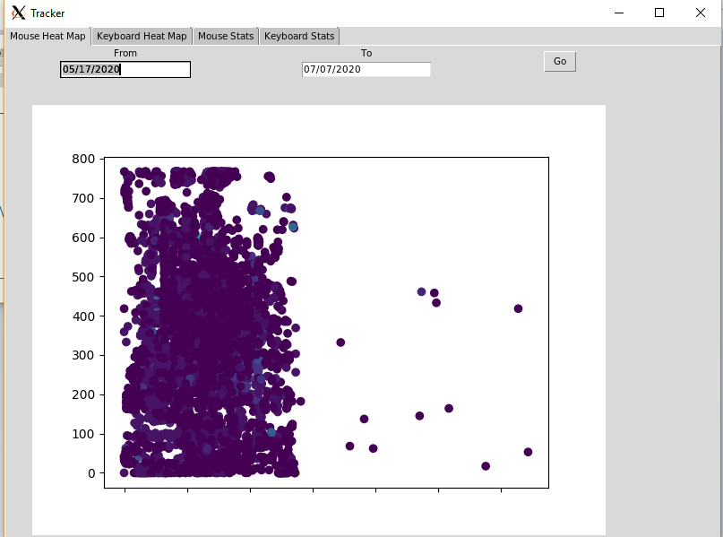
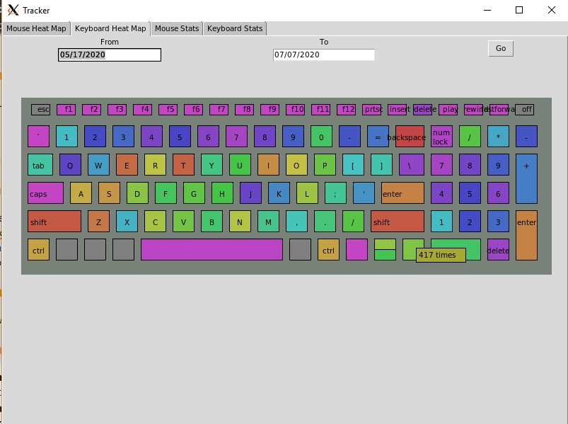
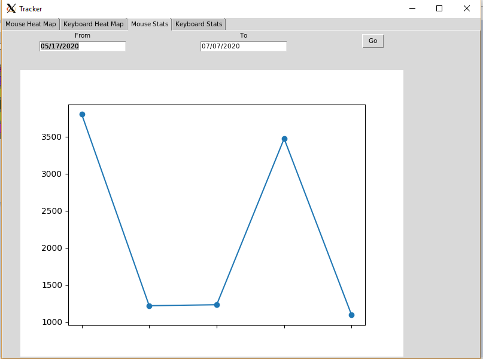
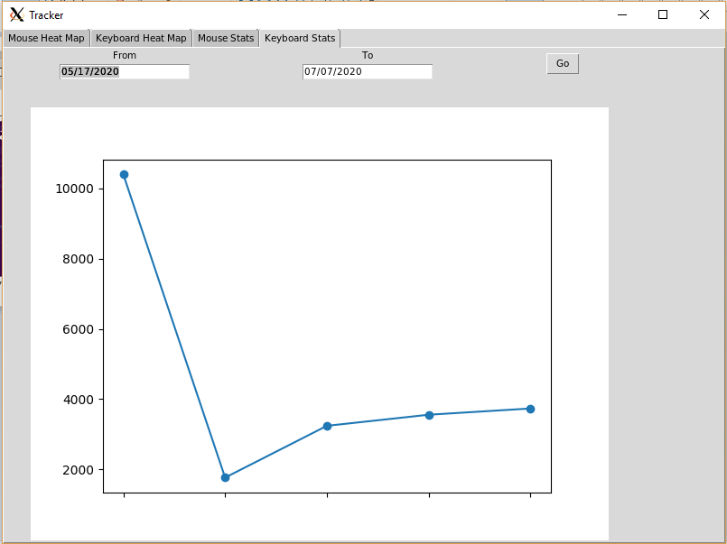

# Typer Tracker

**What is it?** Typer Tracker keeps track of the locations you click on your screen and the characters you type. The data is then stored in a SQL database and aggregated. This is done purely out of curiosity of my computer using habits. The C++ program uses hooks to continuously track actions and periodically updates to the database. The python program displays the data. It can show where you click the most, what keys you press the most, and how much you use both the mouse and keyboard on a given day.

**Project Goals, Skills, and Tools** I originally started this project solely in C++. After working a bit with tkinter, I decided to revamp it so that I could do more interesting things with the data. This is also when I decided to use SQL since so much data would need to be stored.

**Moving On**  Though the project can run pretty well, I'm very interested on improving it. Notably, I don't like how the keyboard drawing code is structured. Its too hardcoded and difficult to change. I'd also like to make better use of the SQL interface. I'm not very familiar with SQL, but I know I can offload some of my data aggregation in python to the database itself. Additionally, there's lots of little features that could be added, like tracking right vs left clicking, measuring times of day that events happened, and changing the scale at which the data is viewed.

